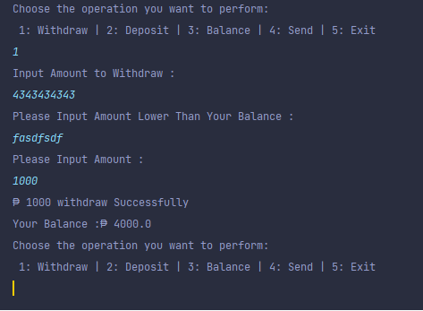

# Simple-ATM
```bash
  SIMPLE ATM THAT HANDLE ALL THE TRANSACTION OF THE CUSTOMER. 
  THE APPLICATION IS ABLE TO ACCEPT USER INPUT AND ABLE TO VALIDATE AND CHECK EVERY ENTRY.
```

# Features
```bash
  ABLE TO RETRIEVE THE CURRENT BALANCE IN THE SPECIFIC CUSTOMER
  ABLE TO DEPOSIT THE CURRENT BALANCE IN THE SPECIFIC CUSTOMER
  ABLE TO WITHDRAW SOME CASH IN THE SPECIFIC CUSTOMER
  ABLE TO SENT A MONEY TO OTHER CUSTOMER
```
# Images





